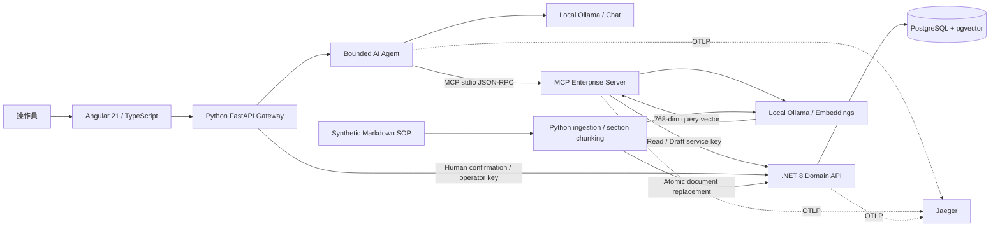

# 架構與資料流

## 調查流程

前端採 Angular standalone components／Router，Signals store 保留跨頁面的操作狀態，typed HttpClient service 統一處理 API 與錯誤。搜尋使用 Reactive Forms；hash routes 及 web/dist 靜態輸出對應既有 gateway。詳見 [前端導覽](FRONTEND.md) 與 ADR-007。

1. 使用者指定 incident 與問題。Host 透過 MCP 讀 incident，建立可信的 machine scope。
2. MCP `tools/list` 的 schema 轉成 Ollama tool definitions。只把讀取 allowlist 工具暴露給 discovery phase。
3. 模型逐輪選擇 `get_machine`、`get_incident`、`get_maintenance`、`search_sop`。Host 驗證工具、參數與 machine／incident scope，再呼叫 MCP。
4. MCP server 透過服務 key 呼叫 .NET domain API；search tool 先向本機 Ollama 取得 embedding，再由 .NET 用 pgvector／PostgreSQL lexical search 排名。
5. 工具結果回到模型 context。最多 8 輪／16 calls。若模型提早結束，Host 回報缺少的 evidence capability；取得 telemetry、maintenance 與非空 SOP 證據後，Host 結束 discovery，避免模型反覆讀取。
6. 模型生成 JSON findings。JSON schema 把引用限制為實際檢索到的 chunk ID；額外 validator 拒絕無引用與重複步驟。驗證失敗允許一次修正，仍失敗改為明確標示的離線 baseline。引用 ID 有效不代表內容語意正確。
7. 保存 run，再提供獨立 draft phase。模型可選擇呼叫 `create_ticket_draft`；host 固定使用驗證過的內容，.NET 再核對 run evidence。`run_id UNIQUE` 保證同一 run 不建立重複草稿。
8. 操作員核對原始證據後，UI gateway 用 operator key 取得 60 秒核准 token 並提交。MCP 沒有核准工具。資料庫原子 UPDATE 消耗 token，同一交易寫 audit event。

以上是多步資料蒐集與決策支援。Events 記錄工具與參數、時間；不記錄或展示模型的私密 chain of thought，也不把它當作正確性證據。

Synthesis 的 input 只保留 domain observations 與來源 ID／標題／原文，移除 retrieval ranking metadata，避免模型把檢索分數誤解成事故可信度。預設使用本機 qwen2.5:7b；仍需要人工評分與核對證據。

## 知識生命週期

文件以 `##` section 分段，ID = document ID + content hash。完整文件在單一交易內替換，移除舊 chunk，避免改版後舊資料仍被搜尋。run 保存當時 evidence 快照，因此歷史調查仍可核對原文。nomic embedding 為 768 維；模型更換需要重建 embedding／調整 schema，不能混用不同向量空間。

小型 corpus 使用 exact hybrid rank；HNSW index 已建立，但混合計分查詢不保證使用 ANN index。放大 corpus 時需分別召回 lexical／vector candidates，再採 RRF 或 reranker。中英混合 keyword 的中文斷詞仍有限，embedding 品質也需要 live eval。

## Trace 與部署邊界

Python 根 span → 每個 MCP tool span → `traceparent` 作為 host 注入的 protocol argument → MCP server domain span → HTTP header → .NET ASP.NET span。LLM span 記錄使用的模型名稱。前端提供 trace ID 與 Jaeger 連結；實際送達證據記於 VALIDATION。

Gateway 與 MCP server 在各自 lifespan 共用 httpx connection pool，CLI ingestion 使用短期 client。這避免每次 domain HTTP read 重建連線。k6 只量測本機讀取 API，沒有量測 LLM 併發推論。Gateway 以單一 semaphore 限制調查 concurrency，尚未提供正式 job queue。

Native 服務監聽 loopback；staging 容器的 API 在 Docker 私有網路監聽，只有 gateway／Jaeger 以主機 loopback port 發布，DB 和 domain API 不發布主機 port。UI 是本機 demo operator identity；service/operator key 是角色分離示範，不是正式 RBAC。MCP child 雖不使用 operator credential，仍共享 OS 使用者與檔案存取權；這不是 OS sandbox。公開部署前需 OIDC、RBAC、TLS、secret store、資料隔離、限流與 threat model。

`compose.staging.yaml` 與兩個 Dockerfile 提供可版本化部署。Angular production assets 由 Python gateway 提供，模型連到 host.docker.internal 的主機 Ollama，traces 送到 staging Jaeger。`scripts/deploy.ps1` 以 readiness／smoke／ingest／AI evaluation 作 release gate，完成才寫成功版本，失敗回復 last successful images。詳見 [CI/CD](CICD.md)。

無設備執行工具、無外部發信、無真實製造資料。Ticket 的 approved 是本機資料庫狀態；沒有發送到外部服務。
